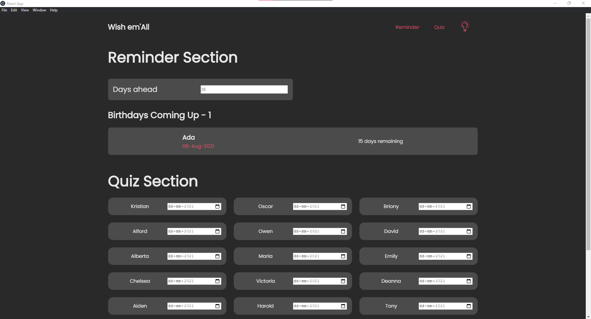
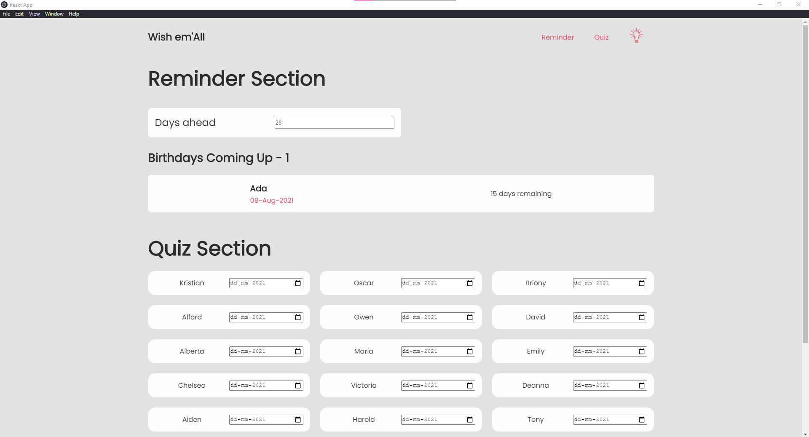
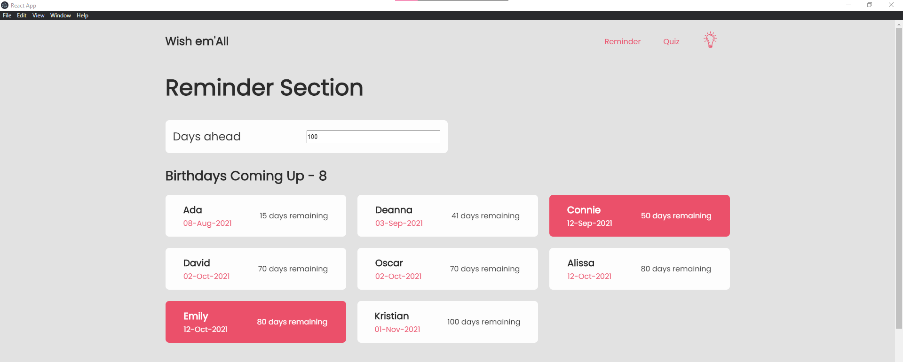
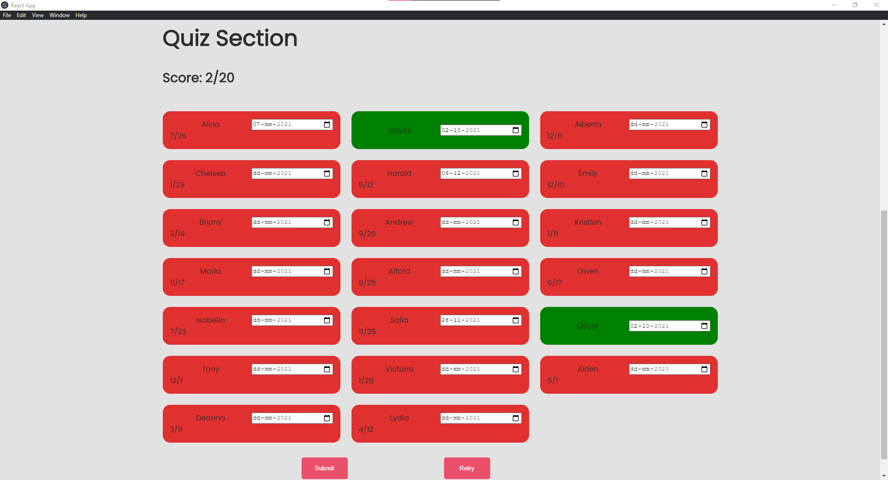

# birthday-application

### Description 
*An electron JS desktop application (built using react JS) that reminds you of upcoming birthdays and poses a randomized quiz. This application can be built to support any OS. The data utilized in this repository is obtained by running a preprocessing script; the methodology and development of this script is enclosed in repository names date-application-data-processing (https://github.com/KrishnaBellamkonda/birthday-application-data-processing).*

### Preprocessing Repository 
* [birthday-application-data-preprocessing](https://github.com/KrishnaBellamkonda/birthday-application-data-processing)

### Table of Contents
* [Description](#description)
* [Preprocessing Repository](#preprocessing-repository )
* [Setup](#setup)
* [Available Scripts](#available-scripts)
* [Technology](#technology)
* [Functionality](#functionality)
* [App in Action](#app-in-action)
* [Sources](#sources)

### Setup 
* Clone the repository and replace the json_data folder by the one created using the preprocessing script (link above)
* Build the application using 
```$ npm run build```
* Run electron packager to package the application 
```$ electron-packager .```
* After the application is packaged, open the newly created folder (name - electron-react-app-${os-name}) and run the application

### Available Scripts
* To start development server
```npm start``` 
* To build optimized version 
```npm run build```
* Package 
```electron-packager .```

### Technology 
* JavaScript 
  - ReactJS 
  - ElectronJS
* Python (preprocessing)


### Functionality 
A ReactJS application is built using `npx create-react-app`. This react application is developed and then in packaged into an electron application. A setup process is required for this process.


### App in Action
* Dark-mode 

* Light-mode

* Upcoming Birthdays section 

* Quiz Section 



### Sources 
1) Creating a Electron React Application (https://www.section.io/engineering-education/desktop-application-with-react/)
2) Electron Documentation (https://www.electronjs.org/docs)
3) Electron packager GitHub (https://github.com/electron/electron-packager)

